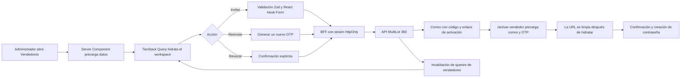

# Módulo de vendedores

## Responsabilidades

- La URL conserva filtros, página y vista para permitir navegación, historial y enlaces compartibles.
- TanStack Query es la única fuente de datos remotos: invitaciones, resumen y estados de mutación.
- Zustand conserva únicamente estado efímero de interfaz: drawer de creación, detalle seleccionado y confirmación de revocación.
- Los Route Handlers actúan como BFF. Leen las cookies `httpOnly`, renuevan la sesión cuando corresponde y nunca exponen el JWT al navegador.
- SVAR Grid presenta el volumen de datos en escritorio; las tarjetas adaptativas cubren pantallas móviles y la vista de flujo explica el ciclo de acceso.

## Flujo operativo



## Estructura

```text
features/sellers/
├── components/   UI del workspace, grid, flujo, drawers y diálogos
├── hooks/        consultas y mutaciones de TanStack Query
├── queries/      claves y opciones de caché
├── schemas/      validación y normalización de entradas
├── server/       cliente privado de API y seguridad de Route Handlers
├── services/     cliente browser contra el BFF
├── store/        estado efímero de Zustand
├── types/        contratos del módulo
└── utils/        filtros URL y formateadores puros
```

## Reglas de seguridad

- El enlace de activación transporta un OTP temporal y de un solo uso, nunca una contraseña ni un token de sesión.
- La página de activación declara `noindex` y `no-referrer`, precarga el formulario y elimina correo/código de la barra de direcciones.
- Reenviar invalida el código anterior en la API.
- Revocar requiere confirmación visible y solo está habilitado en invitaciones pendientes.
- Ninguna mutación de vendedores se realiza durante pruebas visuales sin una acción explícita del usuario.

## Estrategia de caché

- Listas: clave `['sellers', 'invitations', query]` y conservación de la página anterior durante cambios de filtros.
- Resumen: clave `['sellers', 'overview']` con una ventana fresca de 30 segundos.
- Mutaciones: invalidan `['sellers']`, actualizando lista y resumen como una sola unidad consistente.
- El backend actual no expone un endpoint agregado de métricas; el BFF obtiene el total y una muestra de hasta 100 invitaciones en una sola lectura. Si el volumen supera ese límite, la interfaz oculta el desglose para no presentar cifras engañosas. Debe sustituirse por `GET /identity-access/sellers/overview`.
